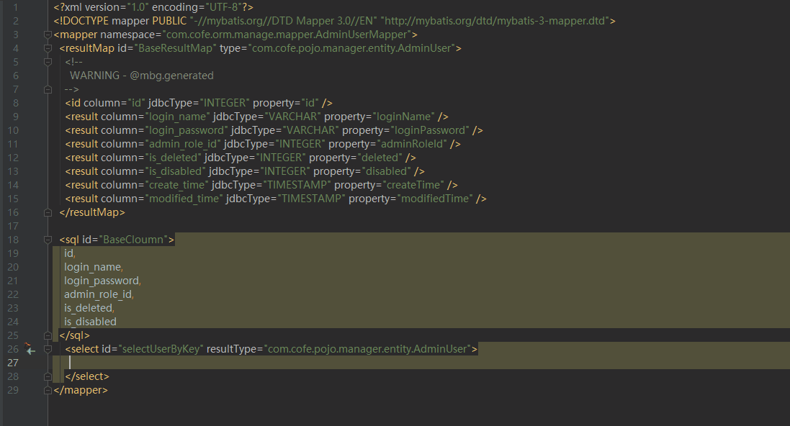

# 前言

感谢 [JetBrains](https://www.jetbrains.com/?from=Cofe-Mybatis) 对此项目的支持。

# 相关地址 

[Gitee](https://gitee.com/cofedream/Cofe-Mybatis) | [GitHub](https://github.com/cofedream/Cofe-Mybatis) | [Jetbrains Marketplace](https://plugins.jetbrains.com/plugin/12808-cofe-mybatis)

# 介绍

本项目最早基于 [free-idea-mybatis](https://github.com/wuzhizhan/free-idea-mybatis) 修改，但因后续功能实现与原本差异较大，便于2018年11月份重新立项。

# 功能完成度与相关快捷键

| 说明 | 完成情况 | IDEA默认快捷键|
| :---: | :---: | :---: |
| Mapper.java 跳转至 Mapper.XML | ✓ | Ctrl+B |
| Mapper.java 方法 跳转至 Mapper.XML CRUD语句 | ✓ | Ctrl+B / Ctrl+Alt+B |
| Mapper.java 方法生成 `@Param` 注解 | ✓ | Alt+Enter |
| Mapper.java 方法生成 Mapper.XML CRUD语句 | ✓ | Alt+Enter |
| Mapper.XML 语句 跳转 Mapper.java 方法 | ✓ | Ctrl+B |
| Mapper.XML 中参数 跳转定义来源 | ✓ | Ctrl+B |
| Mapper.XML 中参数`#{}`/`${}`提示 | ✓ | Ctrl+空格(Completion Base) |
| `<if/>` 标签 `test` 提示 | ✓ | Ctrl+空格(Completion Base) |
| `<when/>` 标签 `test` 提示 | ✓ | Ctrl+空格(Completion Base) |
| `<include/>` 标签 `refid` 提示 | ✓ | Ctrl+空格(Completion Base) |
| `<select/>` 等标签 `resultMap` 提示 | ✓ | Ctrl+空格(Completion Base) |
| `<resultMap/>` 下 `</id>,<result/>` 等标签跳转至对应类字段 | ✓ | Ctrl+B |

# 功能演示

1. 支持Spring注入提示  
2. 支持Mybatis接口与XMl互相跳转   
3. 支持Mybatis接口中Statement 
4. 支持Mybatis接口中@Param生成与XML代码提示 